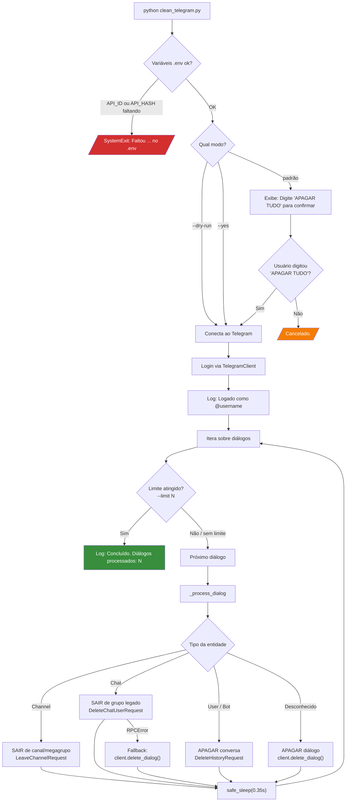
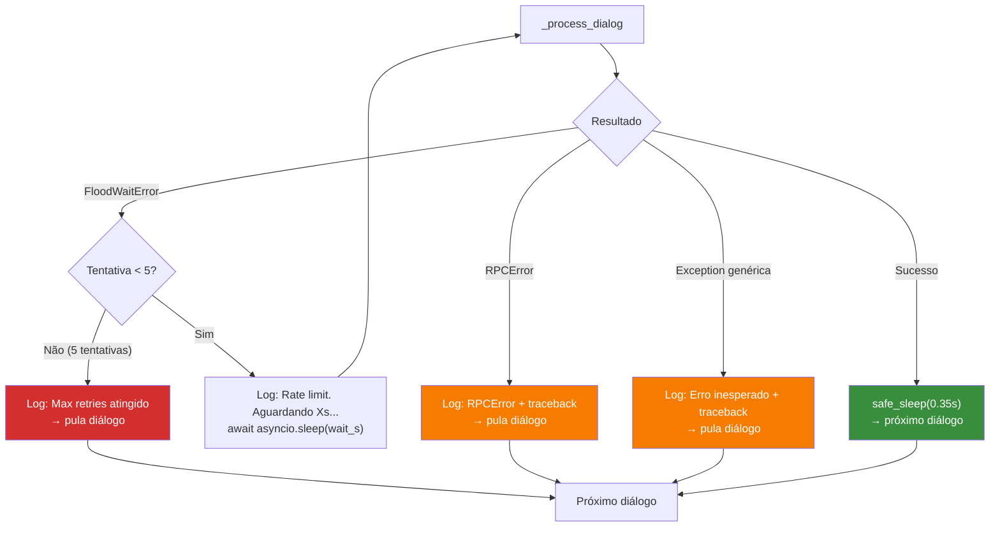

# Fluxo UX — CleanTelegram

Documento que mapeia a jornada completa do usuário ao interagir com o script `clean_telegram.py`.

---

## 1. Visão geral dos fluxos

```text
┌─────────────────────────────────────────────────────┐
│                  JORNADA DO USUÁRIO                  │
│                                                     │
│  ┌──────────┐   ┌──────────┐   ┌────────────────┐  │
│  │  Setup   │──▶│Execução  │──▶│ Processamento  │  │
│  │ Inicial  │   │  & Auth   │   │  de Diálogos   │  │
│  └──────────┘   └──────────┘   └────────────────┘  │
│                                                     │
│  3 modos de execução:                               │
│   --dry-run    Simulação segura (nenhuma alteração)  │
│   --yes        Execução sem confirmação interativa   │
│   (padrão)     Execução com confirmação "APAGAR TUDO"│
└─────────────────────────────────────────────────────┘
```

---

## 2. Fluxo de Setup Inicial (primeira vez)

```text
 USUÁRIO                          SISTEMA
 ───────                          ──────
    │
    │  python -m venv .venv
    │  source .venv/bin/activate
    │  pip install -r requirements.txt
    ├──────────────────────────────────▶ Instala telethon + python-dotenv
    │
    │  cp .env.example .env
    │  (edita .env com API_ID e API_HASH)
    ├──────────────────────────────────▶ Configura credenciais
    │
    │  python clean_telegram.py --dry-run
    ├──────────────────────────────────▶ Primeira execução
    │                                    │
    │  ◀── Telethon pede telefone ───────┤
    │  Digita +55 11 9xxxx-xxxx          │
    ├──────────────────────────────────▶ │
    │                                    │
    │  ◀── Telethon pede código ─────────┤
    │  Digita código recebido no Telegram│
    ├──────────────────────────────────▶ │
    │                                    │
    │  ◀── (se 2FA) pede senha ──────────┤
    │  Digita senha 2FA                  │
    ├──────────────────────────────────▶ │
    │                                    │
    │                                    ├──▶ Salva session.session
    │                                    │
    │  ◀── Dry-run: lista diálogos ──────┤
    │      (nenhuma alteração feita)      │
    ▼                                    ▼
```

> **Nota:** Após o primeiro login, o arquivo `session.session` é reutilizado automaticamente. O fluxo de autenticação não se repete.

---

## 3. Fluxo Principal de Execução



---

## 4. Fluxo de Tratamento de Erros (por diálogo)



---

## 5. Fluxo do modo `--dry-run`

```text
┌─────────────────────────────────────────────────────────┐
│                    MODO DRY-RUN                         │
│                                                         │
│  Tudo funciona igual ao modo real, EXCETO:              │
│                                                         │
│  ✓ Confirmação "APAGAR TUDO" é IGNORADA (não pede)     │
│  ✓ Diálogos são iterados normalmente                    │
│  ✓ Tipo de cada entidade é identificado                 │
│  ✓ Logs são emitidos (SAIR / APAGAR)                    │
│  ✗ Nenhuma request destrutiva é enviada ao Telegram     │
│  ✗ LeaveChannelRequest → NÃO executado                  │
│  ✗ DeleteChatUserRequest → NÃO executado                │
│  ✗ DeleteHistoryRequest → NÃO executado                 │
│  ✗ client.delete_dialog() → NÃO executado               │
│                                                         │
│  O usuário vê exatamente o que SERIA feito.             │
└─────────────────────────────────────────────────────────┘
```

---

## 6. Mapa de decisões do roteador `_process_dialog`

```text
  entity recebida
        │
        ▼
  ┌─────────────┐     Sim     ┌───────────────────────┐
  │ é Channel?  │────────────▶│ leave_channel()       │
  └──────┬──────┘             │ LeaveChannelRequest   │
         │ Não                └───────────────────────┘
         ▼
  ┌─────────────┐     Sim     ┌───────────────────────┐
  │ é Chat?     │────────────▶│ leave_legacy_chat()   │
  └──────┬──────┘             │ DeleteChatUserRequest │
         │ Não                │          │            │
         │                    │    RPCError?          │
         │                    │     ▼ Sim             │
         │                    │ client.delete_dialog()│
         │                    └───────────────────────┘
         ▼
  ┌─────────────┐     Sim     ┌───────────────────────┐
  │ é User/Bot? │────────────▶│ delete_dialog()       │
  └──────┬──────┘             │ DeleteHistoryRequest  │
         │ Não                └───────────────────────┘
         ▼
  ┌─────────────────┐         ┌───────────────────────┐
  │ Tipo            │────────▶│ client.delete_dialog() │
  │ desconhecido    │         │ (fallback genérico)   │
  └─────────────────┘         └───────────────────────┘
```

---

## 7. Tabela de estados do terminal (o que o usuário vê)

| Fase | Saída no terminal | Origem |
|------|-------------------|--------|
| Credenciais ausentes | `Faltou API_ID no .env` | `env_int()` / `main()` |
| Confirmação | `ATENÇÃO: isso vai apagar conversas...` | `main()` via `print()` |
| Cancelado | `Cancelado.` | `main()` via `print()` |
| Login | `Logado como: @user (id=123)` | `logger.info` |
| Canal/megagrupo | `[1] SAIR de canal/megagrupo: NomeCanal` | `logger.info` |
| Grupo legado | `[2] SAIR de grupo legado (Chat): NomeGrupo` | `logger.info` |
| Conversa user/bot | `[3] APAGAR conversa: NomeUsuario` | `logger.info` |
| Tipo desconhecido | `[4] APAGAR diálogo (tipo desconhecido): ...` | `logger.info` |
| Rate limit | `Rate limit (FloodWait)... Aguardando Xs` | `logger.warning` |
| Max retries | `Max retries atingido; pulando 'NomeDialogo'` | `logger.error` |
| Erro RPC | `RPCError em 'NomeDialogo'` | `logger.exception` |
| Erro genérico | `Erro inesperado em 'NomeDialogo'` | `logger.exception` |
| Conclusão | `Concluído. Diálogos processados: N` | `logger.info` |

---

## 8. Cenários de uso típicos

### 8.1 Primeiro uso (cauteloso)

```bash
# 1. Setup
python -m venv .venv && source .venv/bin/activate
pip install -r requirements.txt
cp .env.example .env  # editar com API_ID e API_HASH

# 2. Testar com dry-run
python clean_telegram.py --dry-run

# 3. Testar com poucos diálogos
python clean_telegram.py --dry-run --limit 5

# 4. Executar de verdade (poucos diálogos)
python clean_telegram.py --limit 5
# → Digita "APAGAR TUDO"

# 5. Executar em tudo
python clean_telegram.py
# → Digita "APAGAR TUDO"
```

### 8.2 Uso automatizado (script/cron)

```bash
python clean_telegram.py --yes
# Pula confirmação interativa — usar com cuidado!
```

### 8.3 Debugging de rate limit

```bash
python clean_telegram.py --limit 3
# Observar logs de FloodWaitError
# Ajustar --limit conforme necessário
```

---

## 9. Diagrama de ciclo de vida da sessão

```text
  Primeira execução               Execuções seguintes
  ──────────────────              ───────────────────
        │                               │
        ▼                               ▼
  ┌──────────────┐               ┌──────────────┐
  │ Sem sessão   │               │ session.     │
  │ local        │               │ session      │
  └──────┬───────┘               │ existe       │
         │                       └──────┬───────┘
         ▼                              ▼
  ┌──────────────┐               ┌──────────────┐
  │ Telefone     │               │ Login        │
  │ + Código     │               │ automático   │
  │ + (2FA)      │               │              │
  └──────┬───────┘               └──────┬───────┘
         │                              │
         ▼                              ▼
  ┌──────────────┐               ┌──────────────┐
  │ Cria         │               │ Reutiliza    │
  │ session.     │               │ sessão       │
  │ session      │               │ existente    │
  └──────┬───────┘               └──────┬───────┘
         │                              │
         └──────────┬───────────────────┘
                    ▼
             ┌──────────────┐
             │ Executa      │
             │ limpeza      │
             └──────────────┘
```

> **Importante:** O arquivo `*.session` contém credenciais de autenticação e **nunca** deve ser commitado no repositório.
